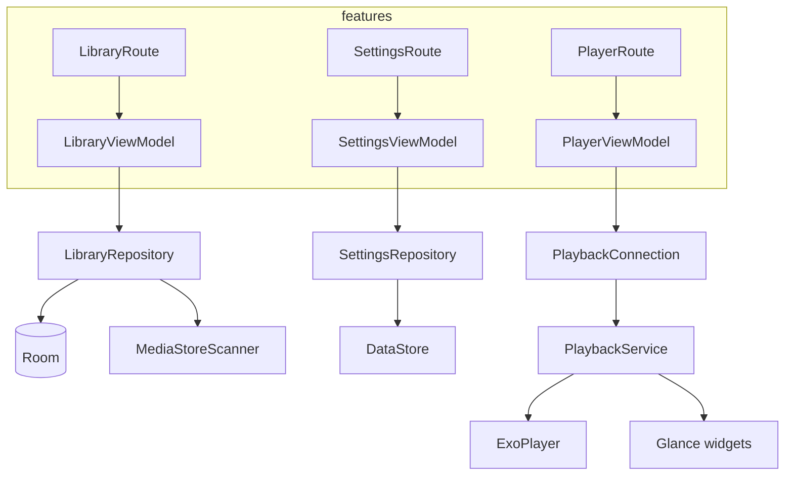

# Resonance

Offline local music player for Android built with Kotlin and Jetpack Compose. The app indexes audio from **MediaStore**, stores library metadata and playlists in **Room**, and plays files with **Media3/ExoPlayer** behind a foreground **PlaybackService** and MediaSession (notifications, lock screen, Bluetooth). UI uses Material You with optional dynamic colors from album art; home screen **Glance** widgets mirror playback state. The architecture prioritizes low-latency local playback and keeps network out of the critical path.

## Structure



## Stack

| Technology | Version |
|------------|---------|
| Android Gradle Plugin | 9.4.0 |
| Kotlin | 2.2.10 |
| Compose BOM | 2026.02.01 |
| Koin | 4.2.2 |
| Navigation Compose | 2.9.3 |
| Media3 / ExoPlayer | 1.11.0 |
| Room | 2.7.2 |
| DataStore | 1.1.7 |
| Glance | 1.2.0 |
| Palette | 1.0.0 |
| compileSdk / targetSdk | 37 |
| minSdk | 29 |
| JVM | 21 |

## Architecture

Feature-based MVVM with Koin for dependency injection.

```
src/
├── common/patterns/
├── design/
│   ├── components/
│   └── theme/
├── di/
├── routes/
├── data/local/
├── services/
│   ├── library/
│   └── playback/
├── features/
│   ├── library/
│   ├── player/
│   └── settings/
└── widgets/
```

## ScreenShots

| Image 1 | Image 2 | Image 3 |
|----------|----------|----------|
|  |  |  |

| Image 4 | Image 5 | Image 6 |
|----------|----------|----------|
|  |  |  |

## Commits

```
git add . && git commit -m ":rocket: Initial commit." && git push
git add . && git commit -m ":building_construction: Added initial project architecture." && git push
git add . && git commit -m ":building_construction: Update project architecture." && git push
git add . && git commit -m ":memo: Updated project documentation." && git push
git add . && git commit -m ":memo: Updated code documentation." && git push
git add . && git commit -m ":white_check_mark: Added feature xyz." && git push
git add . && git commit -m ":wrench: Fixed xyz usage." && git push
git add . && git commit -m ":heavy_minus_sign: Removed xyz." && git push
git add . && git commit -m ":memo: Adjusted project imports." && git push
git add . && git commit -m ":arrow_up: Updated dependencies." && git push
git add . && git commit -m ":arrow_down: Removed dependencies." && git push
git add . && git commit -m ":wastebasket: Removed unused code." && git push
git add . && git commit -m ":test_tube: Added test functionality xyz." && git push
git add . && git commit -m ":construction_worker: Building in progress." && git push
git add . && git commit -m ":construction_worker: Added CI build system." && git push
```

## License

[MIT License](https://opensource.org/licenses/MIT)

Copyright (c) 2026 William Franco.
